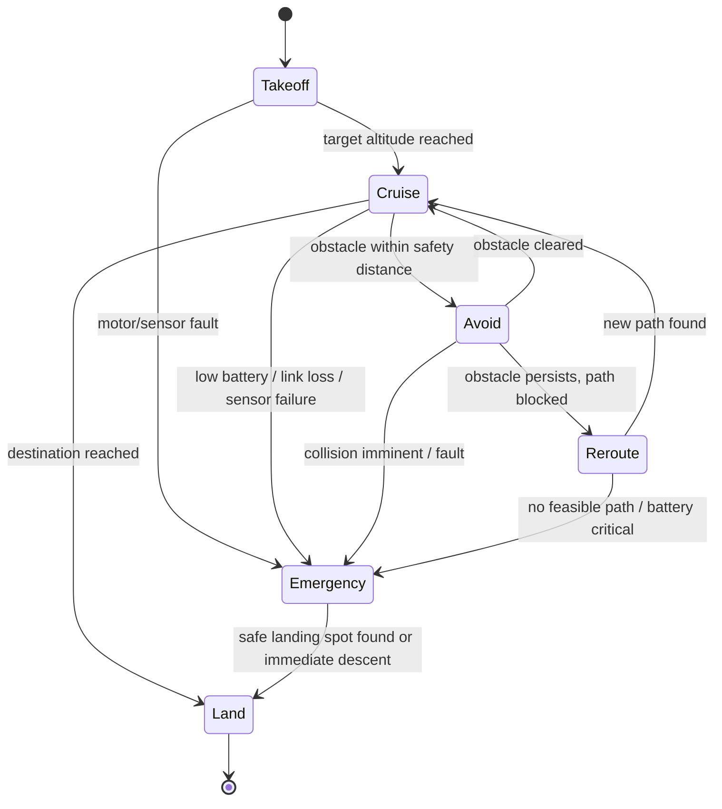

# Graph prompting - Claude outputs (3 case studies)
Tool: Claude, answered directly. Token counts below are approximate word counts (prompt + output).

## Case 1: Smart Irrigation
Approx. words (prompt + output): about 270

**Adjacency list (directed; data/control flows):**
```
Soil sensor  -> Controller            (moisture readings)
Weather API  -> Controller            (rain forecast, temperature)
Controller   -> Valve                 (open/close command)
Controller   -> Pump                  (start/stop command)
Controller   -> Farmer app            (status, alerts)
Farmer app   -> Controller            (manual override, settings)
Pump         -> Valve                 (water flow / pressure; physical link)
Valve        -> (field)               (sink: water delivered)
```
**Critical path:** Soil sensor -> Controller -> (Pump + Valve) -> water in the field. Weather API is an input to the same decision. The action needs both Pump and Valve, so both sit on the critical path.

**Single points of failure:**
- **Controller**: every data and control edge passes through it. If it fails, nothing is watered (and nothing can be overridden).
- **Pump**: no pump means no flow even if the valve opens. **Valve** likewise, per zone.
- **Soil sensor** (if there is only one): the controller becomes blind and must fall back to schedules.
- **Not failures of the automation:** Weather API (the controller can decide from soil moisture alone) and Farmer app (used for oversight and override, not the control loop), though losing the app removes visibility.
- Not modelled but critical: power and network.

Mitigations: watchdog and a safe default schedule in the controller, redundant sensors, manual valve bypass, pressure sensing on the pump.

## Case 2: Drone Navigation
Approx. words (prompt + output): about 260


**Unreachable states:** none. Every state can be reached from Takeoff.

**Dead ends and design issues:**
- **Land** is a terminal state (dead end by design); that is the intended end of the mission.
- **Emergency** has only one exit (Land). There is no path back to Cruise, which is intentional but means any false alarm aborts the mission. Consider a "recovered" transition for transient faults.
- **Avoid <-> Reroute <-> Cruise** can cycle forever (livelock) if the obstacle keeps blocking; add a timeout that sends the drone to Emergency or Land.
- Takeoff has no "abort to Land" edge for non-fault reasons (e.g., bad weather), and Land has no failure edge (e.g., landing zone blocked). These are missing transitions rather than unreachable states.

## Case 3: Robot Path Planning
Approx. words (prompt + output): about 310

Graph (undirected): A-B:4, A-C:2, B-C:1, B-D:5, C-D:8, C-E:10, D-E:2, D-F:6, E-F:3. Source A, target F.

| Step | Node settled (dist) | A | B | C | D | E | F | Note |
|---|---|---|---|---|---|---|---|---|
| 0 | init | 0 | inf | inf | inf | inf | inf | |
| 1 | A (0) | 0* | 4 | 2 | inf | inf | inf | relax A-B (4), A-C (2) |
| 2 | C (2) | 0* | 3 | 2* | 10 | 12 | inf | B improves 4 -> 3 via C; D=2+8=10; E=2+10=12 |
| 3 | B (3) | 0* | 3* | 2* | 8 | 12 | inf | D improves 10 -> 8 via B (3+5) |
| 4 | D (8) | 0* | 3* | 2* | 8* | 10 | 14 | E improves 12 -> 10 via D (8+2); F=8+6=14 |
| 5 | E (10) | 0* | 3* | 2* | 8* | 10* | 13 | F improves 14 -> 13 via E (10+3) |
| 6 | F (13) | 0* | 3* | 2* | 8* | 10* | 13* | target settled |

(* means settled/final.)

Predecessors: F <- E <- D <- B <- C <- A.

**Shortest path A -> F: A, C, B, D, E, F, with total cost 13.** Check: 2 + 1 + 5 + 2 + 3 = 13. Alternative A-C-B-D-F costs 2+1+5+6 = 14, so it is worse by 1.
