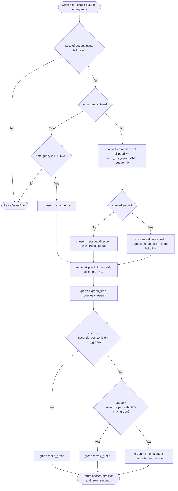

# Step 5 - Flowchart

*Chained from `4_algorithm.md` (`next_phase`, `serve`, `green_time`).*

```mermaid
flowchart TD
    A([Start: next_phase queues, emergency]) --> B{Keys of queues equal N,E,S,W?}
    B -- No --> X([Raise ValueError])
    B -- Yes --> C{emergency given?}
    C -- Yes --> D{emergency in N,E,S,W?}
    D -- No --> X
    D -- Yes --> S1[chosen = emergency]
    C -- No --> E[starved = directions with skipped >= max_wait_cycles AND queue > 0]
    E --> F{starved empty?}
    F -- No --> G[chosen = starved direction with largest queue]
    F -- Yes --> H[chosen = direction with largest queue, ties in order N,E,S,W]
    S1 --> I[serve: skipped chosen = 0, all others += 1]
    G --> I
    H --> I
    I --> J[green = green_time queues chosen]
    J --> K{queue x seconds_per_vehicle < min_green?}
    K -- Yes --> L[green = min_green]
    K -- No --> M{queue x seconds_per_vehicle > max_green?}
    M -- Yes --> N[green = max_green]
    M -- No --> O[green = int of queue x seconds_per_vehicle]
    L --> P([Return chosen direction and green seconds])
    N --> P
    O --> P
```
